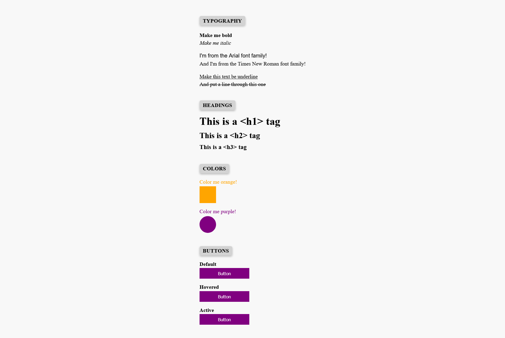

# icodethis - Basics challenge

This is a solution to a challenge from the website https://icodethis.com/. 
The task was to create an HTML page using CSS.

## Table of contents
- [Screenshot](#screenshot)
- [Links](#links)
- [Built with](#built-with)
- [Author](#author)

## Screenshot

## Links

Page URL:(https://axinitm.github.io/ICodeThis-html-css-experiments/))

## Built with

- Semantic HTML5 markup
- CSS custom properties
- Flexbox

## Author

- Website - [Andrei Martinenko](https://www.frontender.biz)
- Github - [@AxinitM](https://github.com/AxinitM)
